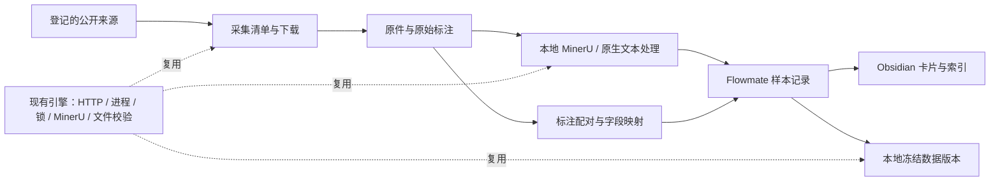

# P0 公开发票数据工作台目标方案 V2

> 日期：2026-09-08  
> 状态：重构目标方案；实现进行中，尚未采集真实数据
> 所属项目：`D:\agent-data\backend\projects\flowmate-data`  
> 本次明确需求：目前没有企业内部数据库和真实发票输入，先从网上获取公开发票信息，尽可能复用 FSD 已实现的能力。  
> 历史依据：[旧 P0 方案](D:/code/Flowmate/docs/07b2b/specs/P0_Obsidian数据库目标方案.md)、[原公开数据源核验](D:/code/Flowmate/docs/07b2b/research/公开发票数据源核验.md)。

## 1. 核心决定

建设一个小型、可重复运行的**公开发票采集与资料管理工具**：输入一个已登记的公开来源，获得发票原文件、该来源提供的标注、可追溯的解析结果，以及可以在 Obsidian 中查看的卡片。

采用以下路径：

```text
公开数据集 / 税务机关公开资料 / 官方票样
  → 固定来源与选样清单
  → 下载原文件及原始标注，保存来源证据
  → 复用现有本地 MinerU / 原生文本处理
  → 保存原件、解析结果、标准化标注之间的关联
  → 生成 Obsidian 卡片
  → 按需冻结本地数据版本
```

FSD 现在是 Paper Knowledge Engine 的一个方向库。**复用它的运行、下载、解析和文件校验能力；保留 Flowmate 自己的发票数据模型。** 不复制一份论文引擎，也不把发票伪装成论文。

MinerU 的配置边界单独维护：Flowmate 从自己的 `config/mineru.local.json` 读取源码版本、虚拟环境、模型、设备、解析参数和进程策略，不读取 `paper-knowledge-engine/config/engine.yaml` 的 `mineru` 段，也不通过 `--library fsd` 获取配置。共享引擎只提供已实现的 MinerU runner、进程监督、结果规整和字段校验代码；公开来源下载所需的 HTTP 代理仍可从 `machine.local.yaml` 读取。

当前只建两个内容库：**公开发票样本库、公开发票知识库**。来源、任务、发布记录是辅助索引。企业真实业务资产库、供应商、PO、收货、ERP、07B2B 账号与页面接入均不在本期范围，也不作为完成条件。

## 2. 当前真实起点

| 项目事实 | 对重构的影响 |
|---|---|
| flowmate-data 只有历史下载脚本，引用的 `packages/data-workbench` 已不存在 | 历史脚本只作为来源线索，不当成可运行实现 |
| `data/flowmate-data` 此前已清空 | 不做旧数据迁移，也不根据旧脚本自动恢复已删除内容 |
| FSD 已迁入 `backend/projects/paper-knowledge-engine` | 以当前引擎源码为复用依据，不恢复旧 fsd-code2doc 项目 |
| 引擎已有本地 MinerU、受控进程、锁、结果规范化、hash 清单、文件替换重试 | 优先复用这些实际能力 |
| 论文 Archive、StateStore、Evidence 和 research 模式仍有领域限制 | 不能承诺“加一个 flowmate 配置就全部可用” |

依据：[Flowmate 当前 README](D:/agent-data/backend/projects/flowmate-data/README.md:1)、[历史脚本](D:/agent-data/backend/projects/flowmate-data/scripts/run-task-7-public-download.ts:1)、[仓库入口](D:/agent-data/README.md:1)、[FSD 复用审查](../research/2026-09-08-fsd-reuse-audit.md)。本次审查基于当前工作树；其中存在未提交修改，不能只用 Git HEAD 代表全部已审查代码。

## 3. “公开发票信息”具体需要哪些数据

### 3.1 数据来源与获得方式

| 需要的数据 | 从哪里获得 | 保存什么 | 能提供什么 |
|---|---|---|---|
| 发票 JPG / PNG / PDF | 公开发票数据集、发布方样例、税务机关票样附件 | 下载原件、来源页面、文件 URL、来源版本、SHA-256 | OCR、版面和表格解析输入 |
| 原始正确字段与框标注 | **与图片配套的数据集标注文件** | 原始 JSON / CSV / 文本、记录 ID、图片配对关系 | 数据集提供的参考答案；缺失时明确无标注 |
| 中文字段、票面结构与格式说明 | 税务机关公告、附件和公开说明 | 页面/附件、标题、发布日期、适用地区、条款或页码 | 字段字典、票种和格式知识 |
| 国际结构化发票示例 | OASIS 等标准发布方 | 原始 XML、标准版本、示例说明 | 后续结构化输入试验；不代表中国税务票据 |
| 解析文本、表格、页级内容 | 本地 MinerU 对已下载文件产生 | Markdown、结构 JSON、页信息、解析配置和输出 hash | 机器解析候选结果，不能自动成为正确答案 |
| 统一字段、缺失状态、样本分类 | 对原始标注做确定性映射；必要时人工核对公开原图 | 映射版本、字段值、原始字段位置、复核状态 | 跨来源查询及后续 OCR 对比 |
| 来源、许可、采集和失败信息 | 采集过程及来源声明 | 来源登记、获取时间、许可证据、任务结果 | 可追踪、重试、复现和判断适用范围 |

公开样本中即使出现供应商名称、PO 号码，也只是票面文字；本期不构造企业供应商主数据或 PO 匹配正确答案。

### 3.2 必须区分的样本性质

每个样本记录 `origin_kind`：

- `synthetic`：发布方明确声明为合成数据。
- `official_example`：官方票样、模板或标准示例，可能没有实际交易值。
- `public_redacted`：发布方明确说明已脱敏的公开票据。
- `public_document`：有来源依据的公开文档，未声明为合成或脱敏。
- `unknown`：来源未能说明性质，保留该不确定性。

另设 `document_kind` 区分 `invoice`、`receipt`、`invoice_template`、`knowledge`。收据、火车票、空白票样不能无差别计入“完整业务发票”数量。真实/合成性质以发布方证据为准，不根据图片外观猜测。

## 4. 已核验的公开来源与优先级

以下为 2026-09-08 的网页核验结果，表示已查到来源和说明，**不表示本次已下载全量文件、复核标注或完成运行验收**。

| 优先级 | 来源 | 可获得内容与获取方式 | 本期处理 |
|---|---|---|---|
| 首批 | [Voxel51 发票数据集](https://huggingface.co/datasets/Voxel51/high-quality-invoice-images-for-ocr) | 英文合成发票；卡片声明 8,181 张、其中 1,489 张有标注。按固定版本读取 `samples.json`，选有标注的记录，只下载对应图片 | 最短闭环输入；图片与来源标注一起保存 |
| 第二批 | [FATURA 发布方原始数据](https://zenodo.org/records/10371464) | 50 种模板生成的发票，配套框、文字、类别标注；原始 ZIP 约 690.7 MB | 用于增加版式覆盖；不是首批闭环硬依赖 |
| 第二批候选 | [SCID 发布方页面](https://davar-lab.github.io/dataset/scid.html) | 六类中文脱敏票据，提供 `ocr.json`、`gt.json`；下载入口另设访问码/申请渠道 | 登记为受限候选；公开标注声明 CC BY-NC-SA 4.0，不能默认用于产品用途 |
| 后续候选 | [Salesforce INV-CDIP](https://github.com/salesforce/inv-cdip) | 350 份有字段标注的发票，关联 UCSF 文档 ID；声明 CC BY-NC 4.0 | 保存索引，核验用途和原文件可得性后再接入 |
| 可选格式补充 | [OASIS UBL 示例目录](https://docs.oasis-open.org/ubl/os-UBL-2.3/xml/) | Invoice / CreditNote 等 XML 示例 | 先归档标准示例；业务语义映射按实际需要增加 |
| 暂缓 | [DocILE](https://docile.rossum.ai/) | 发票等业务文档及字段/行项目标注；获取数据需申请 | 不属于首版免登录公开下载路径；不以代码仓库 MIT 许可替代数据使用条件 |
| 不作主样本 | [CORD](https://github.com/clovaai/cord) | 印尼收据及结构标注，项目声明 CC BY 4.0 | 只在需要收据解析时补充，单独计数 |

**来源核验细节：**

1. Voxel51 页面标记 `odbl`，卡片同时指向原始 Kaggle 许可；[文件列表](https://huggingface.co/datasets/Voxel51/high-quality-invoice-images-for-ocr/tree/main)存在 `samples.json`。卡片数量与页面自动统计行数不同，任务必须以固定版本的实际可配对记录计算数量。本次 Kaggle 页面未返回可核验许可正文，旧核验中的 API 结果作为历史证据保留，正式采集前补齐来源登记，不能把标签解释成无限制再分发许可。
2. [FATURA 的 HF 转换版本](https://huggingface.co/datasets/mathieu1256/FATURA2-invoices)标记 CC BY 4.0，并指回原始发布；首版不为它增加 Parquet/FiftyOne 运行依赖。需要使用时下载原始包，复核包内许可，按来源记录配对图片与标注。
3. 本期不登记其他官方公告、票样或 PDF 来源；需要扩展时再单独核验 URL、许可和结构化解析策略。

**首批确定范围：**只启用一个英文有标注来源 Voxel51。中文官方资料和其他票样不进入当前来源配置，后续按独立来源扩展。

## 5. 首期规模与采集规则

- 首次试运行固定选择 **20 条有配套标注的公开发票**；闭环验证后扩到 **100 条**。这些是任务预算，不是统计准确率承诺。
- 当前不采集额外中文官方资料；知识来源列表保持为空。
- 默认单任务、下载并发 1、解析并发 1。MinerU 模型、设备和解析参数由 Flowmate 自己的 `config/mineru.local.json` 管理，不读取共享 `engine.yaml`；不另设云端“单次 200 文件”约束。
- 每次采集先保存选样清单：来源版本、原始记录 ID、文件路径、标注定位。重试读取同一份清单。
- 可逐文件获取的来源不全库下载。只有 ZIP 的来源明确登记包大小，后续按独立任务处理，不承诺低成本随机读取任意远程 ZIP。
- 第一版手动触发；不建设自动监控、定时爬取、搜索引擎或站点适配器市场。

## 6. FSD 能力复用清单

详见[源码审查备忘](../research/2026-09-08-fsd-reuse-audit.md)。下表区分已有实现与需要补充的接入工作。

| 能力 | 已有实现 | 复用决定及差异 |
|---|---|---|
| 本地 MinerU API 生命周期 | `src/mineru/mineru-api-session.ts` 的 session | 直接复用启动、健康检查和退出回收机制；Flowmate 传自己的工作目录与进程上下文 |
| MinerU 调用 | `MinerUCliJob`、`buildMinerUArgs`、`runMineruCli` | 底层输入是文件路径，`arxivId` 可选；直接传 JPG/PNG/PDF，不经过论文导入入口 |
| 页文本、表格和资源整理 | `normalizeLocalMinerUResult`、页文本和引用处理 | 复用规范化能力；发票样本的质量判定单独定义 |
| 公共 HTTP 请求 | `src/research/http-client.ts` | 复用超时、大小限制、取消和请求处理；默认只允许同源重定向，HF CDN 跳转需要显式的小幅扩展 |
| Windows 受控进程与单任务锁 | `src/runtime/process.ts`、`run-lock.ts` | 复用；锁和进程记录归 Flowmate，MinerU 端口/GPU 使用继续遵守现有互斥要求 |
| 确定性 JSON、文件 hash 清单 | `src/shared/manifest.ts` | 复用 `canonicalJson`、`hashCanonical` 和清单能力；注意现有目录清单默认排除 `source.json`，新发布格式不得遗漏元数据校验 |
| 路径和原子文件替换 | `src/shared/archive-v2.ts` 的校验工具、`src/evidence/atomic-replace.ts` | 复用独立文件工具；不引入论文 Archive schema |
| OpenCLI/arXiv 发现 | `src/discovery`、`opencli/arxiv` | 不用作发票下载；仅在需要找来源时由 Codex 使用已存在的只读工具 |
| 论文 StateStore / 导入 / Archive v2 | 以论文身份、PDF 版本、解析状态组织 | 不直接接入；不往 FSD 数据库加发票记录 |
| Research 整条工作流 | 有部分资料 adapter、source archive 和 CLI | 不作为本期主干；存在固定主题、文件类型、payload 和默认注入限制 |
| Evidence 发布和重建 | 论文/研究资料模板与发布事务 | 复用底层文件机制和可重建思路；发票模板与本地数据发布由 Flowmate 实现 |
| 业务字段、标签配对、来源用途与本地 Dataset Release | 当前引擎无完整对应功能 | 本期新增，范围限定在公开发票 |
| 备份 | 有备份路径及迁移/历史运维代码 | 不声称已有可直接复用的 Flowmate 备份命令；本期提供静止目录快照与校验恢复 |

直接源码依据：[底层 MinerU 输入](D:/agent-data/backend/projects/paper-knowledge-engine/src/types/jobs.ts:103)、[runner](D:/agent-data/backend/projects/paper-knowledge-engine/src/mineru/mineru-cli-runner.ts:84)、[结果规范化](D:/agent-data/backend/projects/paper-knowledge-engine/src/mineru/mineru-local-result.ts:92)、[HTTP](D:/agent-data/backend/projects/paper-knowledge-engine/src/research/http-client.ts:36)、[文件清单](D:/agent-data/backend/projects/paper-knowledge-engine/src/shared/manifest.ts:96)。

### 6.1 两个不能误判的复用边界

**图片支持已经存在于本机 MinerU。** 当前 MinerU 源码处理 PDF 和图片，内部已有图像转换；FSD 高层为论文生成 `.pdf` 工作文件，不代表底层只能收 PDF。Flowmate 保留原始扩展名，直接调用底层 session。接入后必须用真实公开 JPG、PNG 和 PDF 验证，而不是只根据类型定义宣布支持。[本机 MinerU](D:/agent-data/tools/MinerU/mineru/cli/common.py:42)

**Research 模式不是现成发票库。** 其 local-artifact 路径拒绝 JPG/PNG，PDF 可能编码在文本快照中；source archive 仅接受少数固定文件名；parse 路径对 paper/technical-report 特化。为接入发票而放开整套研究领域模型，会比直接复用底层模块更复杂。[本地资料 adapter](D:/agent-data/backend/projects/paper-knowledge-engine/src/research/adapters/local-artifact-adapter.ts:127)、[Research Archive](D:/agent-data/backend/projects/paper-knowledge-engine/src/research/source-archive.ts:15)、[Research 解析](D:/agent-data/backend/projects/paper-knowledge-engine/src/research/research-parse.ts:17)

## 7. 架构选择：保留一个小项目，复用底层实现

| 方案 | 代价 | 决定 |
|---|---|---|
| 重建旧方案的独立采集平台 | 重写下载、MCP、恢复、去重、发布，维护两套基础设施 | 不采用 |
| 给论文/Research 引擎增加发票方向并泛化全部模型 | 涉及主题、来源类型、状态表、Archive 和 Evidence，影响已有论文库 | 不采用 |
| Flowmate 薄业务编排 + 现有引擎底层能力 | 增加来源读取、发票记录、标签映射和卡片，少量共享接口适配 | **采用** |



只保留三个主要职责：

1. **获取与登记**：固定来源、选样、下载、原件去重、采集回执。
2. **处理与记录**：调用解析、配对标注、字段映射、更新样本记录和失败状态。
3. **展示与冻结**：生成 Obsidian、校验和冻结可移植数据版本。

### 7.1 代码组织和依赖

- flowmate-data 使用 Bun / TypeScript，与当前共享引擎一致；不在 P0 单独恢复 npm/Vitest 全套工作区。
- 增加一个 `engine-bridge.ts`，集中调用相邻引擎的现有模块。其他 Flowmate 文件不直接依赖引擎内部路径。
- 第一版不抽取通用 SDK，不建新服务，不发布 npm 包，不复制源码；记录引擎版本和实际使用模块的指纹。
- bridge 显式接收 Flowmate 自己的 MinerU 配置与路径，不能用 `--library fsd` 或默认 FSD 路径来获得运行上下文；共享引擎手册中的只读 `mineru-config` 命令只用于 Paper Knowledge Engine 自身的人工预检。
- 复用同一 MinerU 安装和模型，不要求两个项目同时解析；端口占用或清理不明确时返回可恢复状态，不接管另一任务的进程。
- 需要修改共享 HTTP 行为时，增加可选的来源级重定向许可；现有调用方默认行为不变，并覆盖其回归测试。

这些约定由 Flowmate 的 bridge 和 CLI 实现；真实公开数据采集仍需在本机配置完成后单独验收。

## 8. 公开采集接口：固定来源优先

第一版只需要两个来源读取器：

- `dataset-records`：从固定版本的 JSON 索引中提取样本文件及其标注，首个实例是 Voxel51。
- `public-files`：下载来源配置明确列出的网页、PDF、图片或附件。

FATURA ZIP 等第二批格式，在实际接入时增加一个小型导入器；不提前设计插件注册、自动适配发现或通用爬虫。

OpenCLI 的作用缩小为**发现来源**。已知官网 URL 或数据集文件 URL 直接使用公共下载器，这是本版显式选择，不再要求每次下载都先动态挑选 OpenCLI Adapter。

来源登记至少包含：

| 字段 | 含义 |
|---|---|
| `source_id`、`homepage`、`reader` | 来源身份、说明页、读取方式 |
| `revision`、`record_locator` | 固定版本和原始记录定位；无版本的网站记录获取时间及内容 hash |
| `allowed_origins`、`redirect_origins` | 可请求的精确来源及可重定向目标 |
| `declared_license`、`license_evidence` | 发布方声明、对应页面或文件证据 |
| `retention`、`local_use`、`redistribution` | 分别记录留存、本地使用和再分发范围；不能合并为一个 `allowed` |
| `origin_kind`、`language`、`document_kind` | 数据性质、语言、文档类别 |

HF 文件可能跳转 CDN，不能只允许 `huggingface.co` 后声称下载链路已打通，也不能放开任意重定向。每一跳检查配置的目标；回执保留稳定文件 URL 和最终 host，去掉临时签名查询参数。网页只抽取已配置链接，不执行下载内容中的脚本。

来源政策是可读的小型配置表，不建设自动法律推断系统。已配置允许范围内的数据自动入库；用途或来源不明的候选只登记索引或隔离，不要求用户逐条确认正常样本。

来源 URL、许可登记和数据集数量放在唯一的 `config/sources/voxel51-invoice-ocr.json`；采集数量和任务默认值放在本机忽略的 `config/workbench.local.json`。首批默认选 `voxel51-invoice-ocr` 的 `initial-20`，`sample.acquire_limit` 同时决定获取和解析的有标注图片数量；`record_count=8181`、`annotated_record_count=1489` 防止采集数量超过可用上限。命令行的 `--selection`、`--limit` 等参数可以覆盖默认值，但不能突破来源上限。配置字段和完整示例见 `config/README.md`。

## 9. 文件、记录与 Obsidian 的关系

### 9.1 物理位置

以下是目标目录，本次不创建运行数据或 Vault：

```text
代码与文档
D:\agent-data\backend\projects\flowmate-data\
├─ config\
│  ├─ paths.local.json          本机存储根目录
│  ├─ workbench.local.json      采集数量、来源选择和任务默认值
│  ├─ mineru.local.json         Flowmate 独立 MinerU 参数（本机忽略）
│  └─ sources\                  URL、revision、许可和解析策略

原始数据
D:\paper\Invoice\
├─ datasets\
│  └─ <dataset-id>\
│     └─ samples\
│        └─ <sample-id>\
│           ├─ original.<ext>    原始发票文件，保留原扩展名
│           ├─ annotation.<ext>  发布方原始标注；没有标注时不存在
│           └─ structured\       结构化结果的本地镜像副本
│              ├─ snapshot.json  镜像清单及来源/结果 hash
│              ├─ label.json     统一字段；没有可用标签时不存在
│              └─ parsed\        已选解析 attempt 的规范化结果
└─ knowledge\
   └─ <source-id>\
      ├─ originals\             税务机关公告、票样和格式资料原件
      └─ structured\            正文、页结构等结构化结果镜像

处理数据（已有 Git 忽略规则覆盖）
D:\agent-data\data\flowmate-data\
├─ datasets\
│  └─ <dataset-id>\
│     ├─ dataset.json           发布方、托管平台、版本和许可证据
│     ├─ revisions\<revision>\dataset.json  每个来源版本的不可变元数据
│     └─ samples\
│        └─ <sample-id>\
│           ├─ record.json      原件引用、状态、SHA-256 和文件关系
│           ├─ label.json       统一字段映射；没有可用标签时不存在
│           └─ parsed\          MinerU 解析结果；尚未解析时不存在
├─ releases\<version>\          manifest、checksums 和可移植数据
├─ policies\
│  └─ withdrawals.json          来源撤回清单；恢复时以当前清单重新应用
└─ work\                        下载和解析的临时任务目录

Obsidian
D:\obsidian\data\flowmate-data\
├─ 01_Index\
├─ 02_Sources\
├─ 03_InvoiceSamples\
│  └─ <dataset-id>\
├─ 04_InvoiceKnowledge\
│  └─ <source-id>\
└─ 05_Releases\

备份
D:\agent-data\backups\flowmate-data\
```

`D:\paper\Invoice` 保存网上下载的原件、发布方原始标注，并按本次确认要求额外保存一份结构化结果镜像；`D:\agent-data\data\flowmate-data` 不重复保存原图、PDF 和发布方原始标注，但仍是结构化处理过程和机器记录的主存储。结构化镜像由处理数据单向生成，包含统一标签及选定 MinerU attempt 的完整规范化目录；不允许从 `D:\paper` 反向覆盖机器记录，也不建设双向同步。发布版本可以为了离线可移植性复制获准包含的原件，备份则是恢复副本。

同一数据集的不同来源 revision 使用各自的 `revisions/<revision>/dataset.json` 保存发布方版本与许可证据；根目录 `dataset.json` 只作为首个版本的稳定兼容入口，绝不覆盖已有版本元数据。

许可未知、解析失败等用记录状态和筛选视图表达，不再为每个状态复制一套原件目录。明确不允许留存的内容不进入 `D:\paper\Invoice`；仅记录必要的来源与拒绝原因。

### 9.2 唯一记录与可重建视图

- 原件不可覆盖；SHA-256 写入处理数据中的 `record.json`，用于完整性校验和重复识别，不作为目录名。
- `policies/withdrawals.json` 是当前来源撤回清单的权威副本；备份可保留历史清单，但独立恢复优先应用当前清单。目录重建将撤回条目标为 `withdrawn`，Release 拒绝再次发布，不能用旧备份恢复为可发布状态。
- `datasets/<dataset-id>/samples/<sample-id>/record.json` 是该样本来源关联、标签、解析 attempt 和状态的唯一可写机器记录。它通过 `original_ref` 和 `annotation_ref` 引用 `D:\paper\Invoice` 中的原始数据。
- 每次样本完成标签映射或解析后，从机器记录、`label.json` 和可选的 `parsed/<parse-attempt-id>/normalized` 生成 `D:\paper\Invoice\datasets\<dataset-id>\samples\<sample-id>\structured`。先在临时目录完成 hash 校验，再以可恢复的目录交换更新镜像；镜像的 `snapshot.json` 记录源 record hash、label hash、parser key、attempt id 和每个镜像文件 hash。尚未解析的样本先保存标签快照，解析完成后再把选定 attempt 加入同一镜像。
- 同一机器记录和 attempt 重跑时，结构化镜像必须字节一致；标签映射或解析配置变化时先在处理数据中产生新版本，再重建镜像。镜像损坏可以从处理数据重建，镜像中的手工修改不能回写。
- Obsidian 卡片由记录生成；不建设双向同步、Obsidian API 服务或“应用未打开时的待写队列”。磁盘可写即可生成 Markdown。
- 用户自己的补充笔记放在独立目录，生成器不覆盖；修改生成卡片不会反向改变记录。
- Bases 只负责筛选已有文件属性，不充当后台数据库。[Obsidian Bases 官方说明](https://help.obsidian.md/bases)
- 原图、PDF、发布方标注和结构化镜像都不复制到 Vault。卡片生成指向 `D:\paper\Invoice` 的本机链接；Release 内所有引用相对 Release 根解析。
- 首版数据规模不需要新建 SQLite 索引。少量 JSON、确定性扫描和一个任务锁足够；已有论文数据库继续只管理论文。

## 10. 发票字段与标签设计

### 10.1 第一版字段范围

| 统一字段 | 来源与处理规则 |
|---|---|
| 发票号码、日期 | 使用配套原始标注；日期只按该来源明确格式转换 |
| 销方、购方名称 | 保留原标注值与原字段位置，不推导企业主数据 ID |
| 销方/购方税号 | 来源有标注才映射；没有时保留缺失状态 |
| 币种 | 来源明确提供才填写，不能因英文票据而默认 USD |
| 未税金额、税额、价税合计 | 十进制字符串；只有来源语义明确时映射，不能把含糊的 tax 字段直接当税率或税额 |
| 行项目 | 先保留来源给出的描述、数量和金额；单位价格/行总价语义不明时保留原字段 |
| 页码/文本框 | 来源有位置标注时保留；不虚构不存在的框坐标 |

原始标注独立保留，统一格式属于派生结果。首版字段映射采用确定性规则，不用 LLM 猜答案。

### 10.2 正确答案与解析结果分开

`label_kind` 为 `none`、`dataset_annotation` 或 `human_reviewed`。MinerU 结果始终属于 `derived`，不得自动提升为标签。

每个映射字段至少记录：值、原始字段定位、状态（`provided / missing / ambiguous`）。标注文件与样本通过来源记录 ID 配对，不能按目录排序或近似文件名猜测。

样本主记录至少包含：

```text
schema_version
sample_id                    来源ID + 原记录ID 的稳定身份
dataset_id / dataset_revision / source_record_id
origin_kind / document_kind / language / layout_group
original_ref / original_sha256 / annotation_ref / annotation_sha256
source_observations
label_ref / label_sha256 / label_kind / mapping_version
derived_ref / parser_key / parse_attempt_id / content_sha256
quality_status / processing_status / allowed_uses
created_at / updated_at
```

不是每条样本都有标签和解析结果，相关字段允许缺省。官方空白票样标记 `label_kind=none`，可以进入格式资料集；只有拥有可用标签的条目才进入字段对比子集。

## 11. 解析、去重与恢复

### 11.1 文件处理策略

| 格式 | 本期处理 |
|---|---|
| JPG / JPEG / PNG / PDF | 通过桥接调用现有本地 MinerU；保留原件和全部选定输出 |
| JSON / Markdown / TXT | 原生读取及校验；不调用 OCR |
| HTML | 保存允许留存的源内容，提取正文并保留来源；只处理固定来源 |
| XML | 归档原件及来源，初期不承诺税务语义提取 |
| OFD / DOC / 其他附件 | 可作为 `raw_only` 资料登记；不伪装成已解析，也不为首版另建转换链 |

解析成功要求输出可读取、正文或结构内容合理、原件/输出 hash 可校验、引用资源存在。不能照搬论文的长度或“每页必须大量正文”等质量阈值。发票解析成功也不等于金额识别正确。

`parser_key` 包含解析器版本/源码版本、模型、后端、语言、解析方式及影响输出的配置。每次新解析保留独立 attempt；重试优先使用同一原件和已验证的成功产物。改配置或显式重新解析产生新记录，不覆盖旧结果。

### 11.2 去重保持简单

1. 来源记录身份去重：重复采集同一来源版本/记录，不生成第二张样本卡。
2. 原文件 SHA-256 去重：同一数据集内的重复记录标记 `duplicate_of`；跨数据集相同文件仍分别保存在各自数据集目录，以保留独立来源和许可关系。首版不引入内容寻址目录或文件链接。
3. 正文 hash 只提示派生内容重复，**不据此删除发票图片或合并业务样本**；不同布局可能产生相同文本。

同 URL 内容变更记录新版本；同原件有不同标注时保留各标签版本，不把第一个标签当作唯一真值。

### 11.3 单任务和恢复

任务状态保持为 `selected → downloaded → processed → cataloged → completed`，记录每条样本状态；失败样本不抹掉其他已完成样本。任务全部成功才能是 `completed`，部分失败标记 `partial`。

- 下载失败从未完成文件继续；临时文件通过 hash/MIME 校验后才进入 `D:\paper\Invoice\datasets\<dataset-id>\samples\<sample-id>`。
- 解析失败保留原件及失败原因，可单独重试；退出码为零但产物缺失仍算失败。
- 卡片写入失败直接从处理数据中的 `record.json` 重建；Obsidian 是否运行不影响记录安全。
- 403、401、许可不明和不支持格式不做盲目网络重试。临时网络故障最多三次并退避。
- FSD 正在使用同一 MinerU 端口时等待下次任务或报告忙；不能杀掉对方进程。

## 12. 本地数据版本与对外接口

本期“发布”指**本机冻结数据版本**，不自动上传 Hugging Face、GitHub 或其他平台。

保留单一 `DatasetManifest` 输出给后续实验，定义为新的 `flowmate-public/1`，不冒充已实现旧版 `1.0` 的兼容实现。当前没有可执行旧消费者；将来如有消费者，再提供显式转换。

Manifest 包含：版本、用途、创建时间、采集清单指纹、引擎/解析/映射版本、来源及许可证据、条目与文件清单。条目包含稳定 ID、性质、原件、可选标签、可选解析结果、文件 hash、适用用途与样本组。

冻结过程：

```text
选定样本记录
→ 检查来源用途和条目条件
→ 复制所需 payload 到临时发布目录
→ 使用相对路径生成 manifest.json
→ 为 payload、来源证据及 manifest 生成 checksums.json
→ 全量校验
→ 原子提升到 releases/<version>
```

`checksums.json` 不包含自己的 hash；其 hash 写入独立发布回执。若复用 `archiveFileManifest`，显式纳入被其默认排除的 `source.json`，避免元数据不受校验。相同版本存在时只允许验证相同内容，不原地覆盖。

Release 必须脱离原数据根和 Vault 仍可读取。允许这一次为可移植发布复制选中原件；原始存储内部仍保持去重。只读文件属性作为辅助，完整性以 hash 校验为准。

公开数据按 `development / regression` 使用，不设企业生产 `acceptance`。相同原件、同一发票的背景变体不能跨子集；存在模板组时按组划分。只有单一模板来源时，明确记录无法验证跨版式泛化。

## 13. Obsidian 使用体验

打开索引可以直接看到：

- 公开来源清单：已启用、候选、受限、失败。
- 发票样本表：语言、票种、合成/官方/公开文档、有无标注、解析状态、版式、来源。
- 样本详情：原文件链接、来源页面、原始标注、统一标签、MinerU 结果及错误说明。
- 知识资料表：中文字段说明、官方票样、文件格式，显示发布时期和适用范围。
- 数据版本表：样本数、有标注数、格式分布、已知缺口、Manifest 位置。

不展示“供应商匹配率”“PO 正确率”“07B2B 录入成功率”等本期没有数据依据的指标。

## 14. 从旧方案删掉或调整什么

| 旧方案 | V2 决定 |
|---|---|
| 三个逻辑业务数据库齐备 | 只做公开样本和公开知识，企业资产留到后续 |
| 大型 Acquisition Orchestrator + 多层 Gateway | 固定来源读取器 + 小型任务流程 |
| 每次动态发现 OpenCLI Adapter | 找来源时使用；固定 URL 直接下载 |
| MinerU 云 MCP + CDN TLS 包装修复 | 使用现有本地 MinerU session |
| 单次 200 文件强制契约 | 改为显式任务预算和现有本地并发配置 |
| 原样复刻多级 Raw/Derived/Quarantine/Failure 目录 | 一个样本一个目录，状态写入 `record.json` |
| 自动 License/Privacy 通用引擎 | 小型来源用途表与内容检查，未知项不能伪报通过 |
| 检测所有人脸、住址、隐藏凭证等通用承诺 | 不建设通用 DLP；用已知来源范围与明确数据性质控制输入 |
| 所有样本必须有完整解析和人工答案 | 分开表示归档、解析、标签可用性 |
| 正文重复就默认只保留 canonical item | 保留样本版式与标签差异，正文只作提示 |
| Obsidian 未打开则等待写队列 | 直接写文件，卡片可重建 |
| 独立搭建 SQLite + 双向同步 | 首版 JSON 记录、Markdown 视图 |
| 每个历史门禁都是 P1 硬前置 | 本次公开数据闭环独立验收；不以企业数据是否可得阻塞 |

本版只调整当前 P0 工作范围。旧总方案和旧实施计划里与此冲突的 P0 前置条件，实施计划阶段需要同步更新，不能继续混用两套验收标准。

## 15. 实施顺序与可验收输出

这是目标拆分，不是逐文件编码计划。

| 阶段 | 交付 | 完成判据 |
|---|---|---|
| A：共享能力接通 | Flowmate bridge、Voxel51 来源配置、工作路径隔离 | Voxel51 公开 JPG/PNG 能经本地 MinerU 产生可校验输出；PDF 路径用本地 fixture 验证；不改写 FSD 数据 |
| B：公开样本闭环 | 固定选样、原图+原始标注、配对和统一记录 | 20 条公开有标注样本可追踪；重复执行不重复建档，失败可恢复 |
| C：知识与 Obsidian | 样本卡片、索引和可复用知识读取器 | Voxel51 样本卡片可重建；知识读取器保留但没有额外来源登记；Obsidian 关闭时也能生成 |
| D：版本冻结与恢复 | 本地 Release、校验和、备份/恢复证据 | 独立目录中 Manifest 引用和所有 hash 有效，可离线重建卡片 |
| E：来源和规模扩展 | 100 条及多版式/中文候选接入 | 根据实际覆盖缺口增加来源，不要求企业数据 |

本期完成条件是 A～D；E 按需求扩展。第一版不因缺少 SCID 访问条件、真实企业发票或 07B2B 平台信息而阻塞。

## 16. 验收与备份

验收检查具体行为，不用“模块都有测试”替代真实闭环：

1. 原图和来源标签一一对应，来源 revision、记录 ID、文件 hash 可追溯。
2. 同一任务重跑、同文件不同 URL、下载中断均不产生错误重复或丢失已有文件。
3. Voxel51 JPG/PNG 实际解析成功；PDF 路径由本地 fixture 验证；损坏文件明确失败；DOC/OFD 等登记为未解析。
4. 无标签可以归档，但不能进入有标签对比子集；MinerU 输出不能冒充标签。
5. 同图标签更新、同 URL 文件更新、解析配置变更都产生可区分版本。
6. 网页/CDN 下载验证大小、类型和重定向；原文件下载错误页不能被当作图片。
7. 生成卡片可删除后重建；用户独立笔记不被覆盖。
8. Release 被复制到另一目录后不依赖原机器绝对路径；篡改文件或标注必须被校验发现。
9. 共享代码有变化时，运行所涉及的 HTTP、进程、MinerU、文件校验回归；不对已有 FSD 数据运行破坏性测试。

备份在 Flowmate 无运行任务时生成，包括 `D:\paper\Invoice` 的原始数据与结构化镜像、处理数据中的 `datasets` 和 `releases`，以及 Obsidian 用户补充笔记。`work` 和可重建卡片无需备份。恢复到独立目录后同时校验原件 hash、机器记录 hash 和结构化镜像的 `snapshot.json`，再重新生成卡片并打开样本。

同机快照满足本期误操作恢复演练；另盘备份用于磁盘损坏恢复。若来源要求撤回，维护撤回清单，恢复时重新应用；不可通过备份重新激活已禁止使用的条目。

## 17. 本次交付与后续边界

本次交付是这份目标方案及源码复用审查，没有安装依赖、运行采集、解析文件、创建 Vault 或修改 FSD 实现。

下一步依据本方案编写小型实施计划，首先验证 **公开发票原图 + 配套标签 + 已有本地 MinerU** 的闭环，再补卡片和版本冻结。无需等待公司数据库；无需先建设企业数据治理平台。
